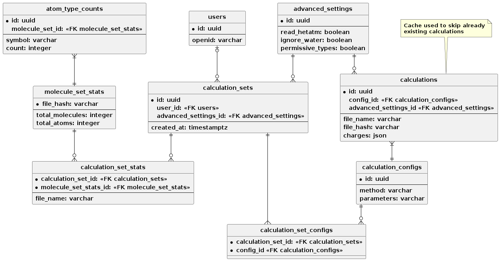

# Database
Database engine is PostgreSQL and the related code is located [here](../../../src/backend/app/db/).

## Schema



Schema definition is located in the [schemas directory](../../../src/backend//app/db/schemas/).

_Note_: Schema also contains `alembic_version` table used by alembic.

## Migrations
Migrations are handled by `alembic`, with related code being located [here](../../../src/backend/app/db/alembic/).

### Creating a new migration
```bash
$ cd src/backend/app
$ poetry run alembic revision --autogenerate -m "<migration name>"
```

### Running migrations
```bash
$ cd src/backend/app
$ poetry run alembic upgrade head
```

## Updating the database schema
Make sure to import the new table in [env.py](../../../src/backend/app/db/alembic/env.py) so that its picked up by the migration script.
