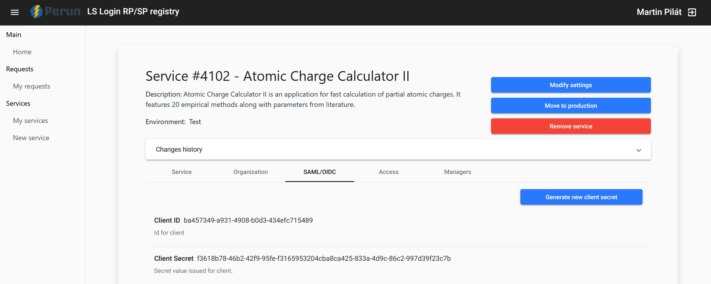
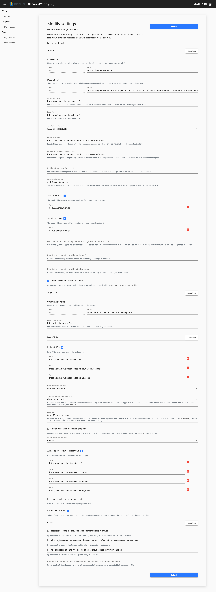

# Auth
- [Test environment login](./test-login.md)
- [Moving test to production](./move-to-prod.md)

Life Science Auth is implemented using the OpenID Connect protocol. You can read more [here](https://docs.google.com/document/d/17pNXM_psYOP5rWF302ObAJACsfYnEWhjvxAHzcjvfIE/edit?tab=t.0#heading=h.suudoy1bqtvm) and [here](https://lifescience-ri.eu/ls-login/documentation/service-provider-documentation/service-provider-documentation.html). 

API endpoints related to auth are implemented in [auth.py](../../../src/backend/app/api/v1/routes/auth.py) and a service used for fetching OIDC data is located in [oidc.py](../../../src/backend/app/services/oidc.py).

## Registering a New Service
New service can be registered [here](https://services.aai.lifescience-ri.eu/spreg/auth/requests/new). In order for ACC II to work with your new service, be sure to set the following values:
- Redirect URIs
- *Flows the service will use* set to `authorization code`
- *Token endpoint authentication type* set to `client_secret_basic`
- *PKCE type* set to `SHA256 code challenge`
- *Scopes the service will use* choose `openid`

The full configured form is shown in the [Registry Form section](#registry-form).

## Life Science AAI SP Registry
After the application was successfuly registered, you can set the  *Client ID* (`OIDC_CLIENT_ID`) and *Client Secret* (`OIDC_CLIENT_SECRET`) in the [.env file](../../../src/backend/app/.env). These values are located [here](https://services.aai.lifescience-ri.eu/spreg/auth) under the *My Services -> service name -> SAML/OIDC* section.

### Registry Form
The following configuration was used for ACC II test registration:

