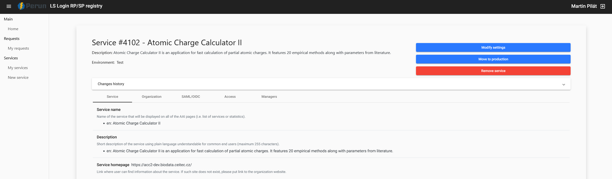
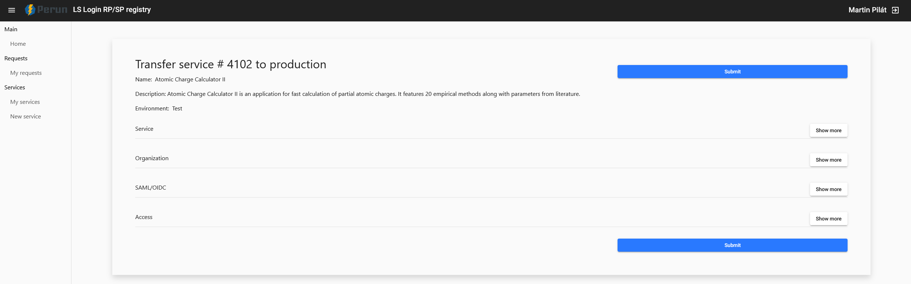
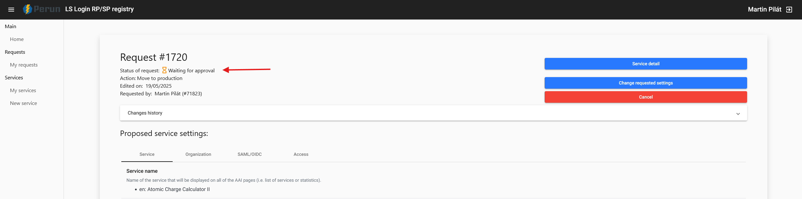
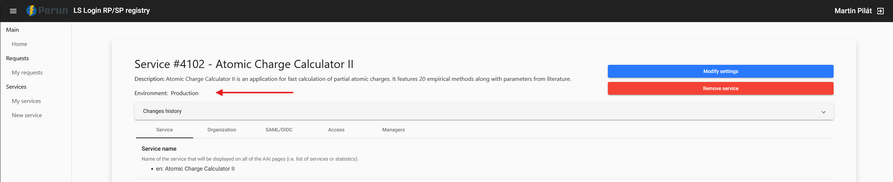

# Move Life Science Login to Production
Since the test environment is not supposed to be used in production, the environment (or service) needs to be *moved to production*.

1. Open the service and click on the *Move to production* button.

2. Verify service information and click on *Submit*.

3. Wait for approval by LS administrators.

4. After approval, the service should look like this:
