# Logging to Life Science Test Environment
First-time Life Science Login (test environment) requires a few additional steps to go through.

1. After clicking on *Log in* on ACC II page, choose your institution.
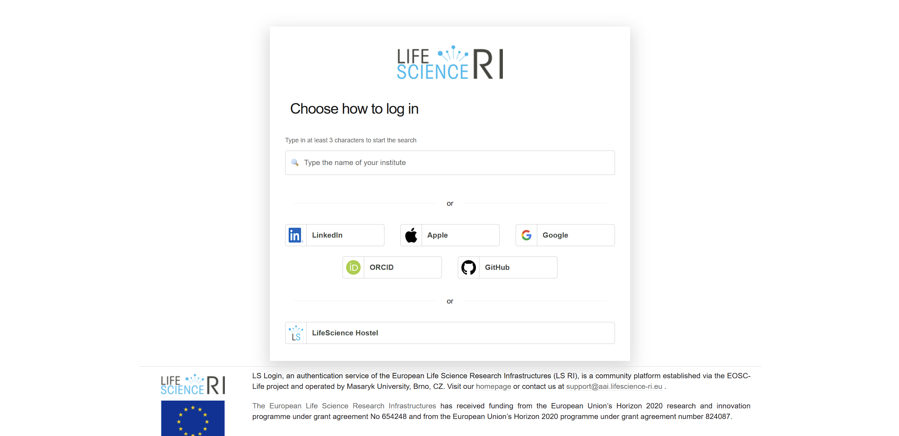

2. Login via your institution.
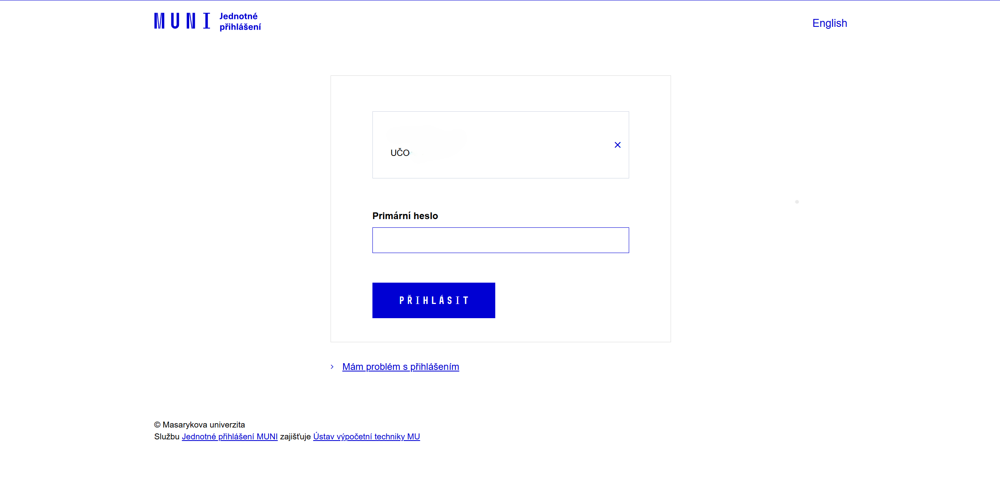

3. Proceed to Life Science register.
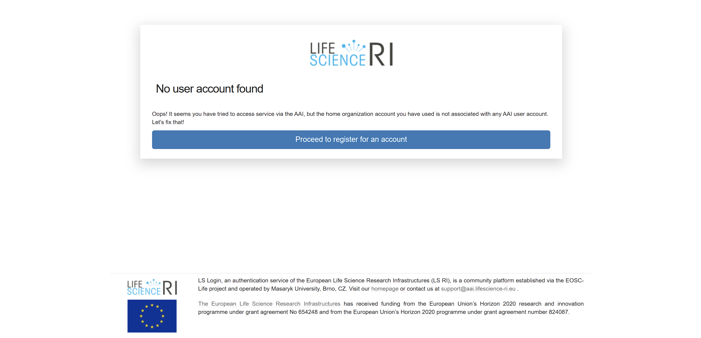

4. Check your information, accept privacy notice and acceptable use policy, and submit.
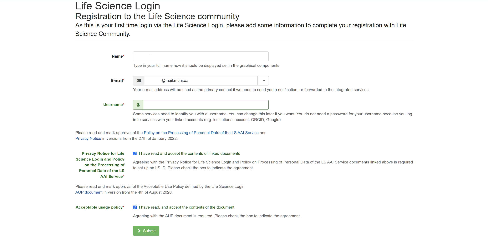

5. Accept (again) and submit (again).
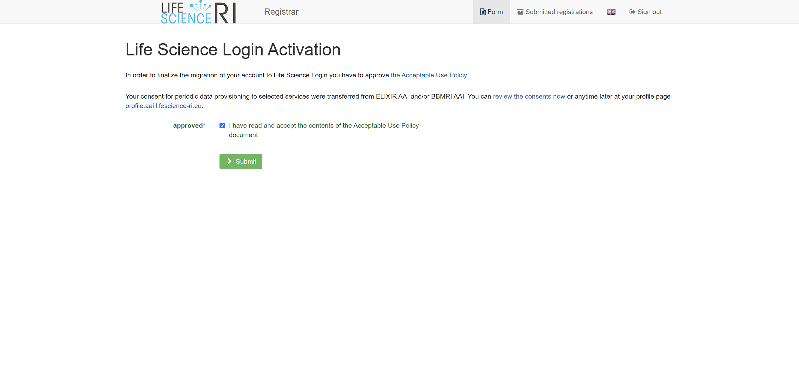

6. Verify your email and continue.
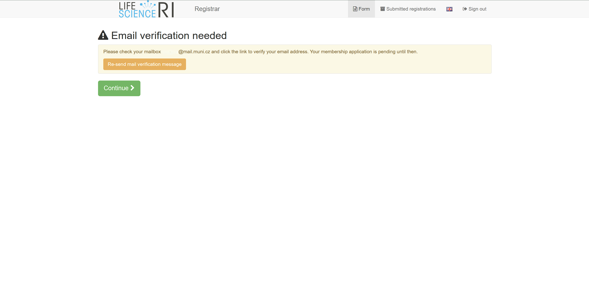

7. Continue after successful verification.
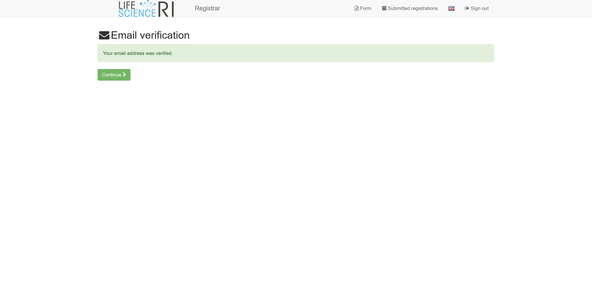

8. Continue to the test service.
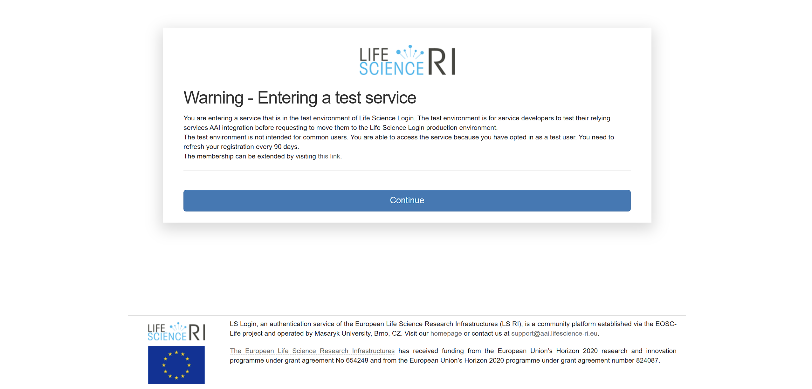

9. Click on the *Register into Life Science Community - Test Environment*.
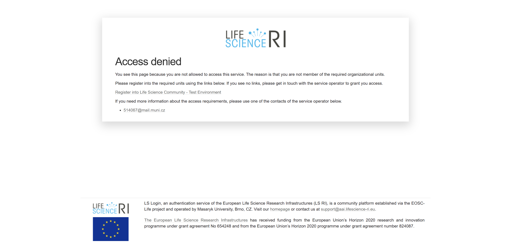

10. Submit. Test membership expires after 30 days.
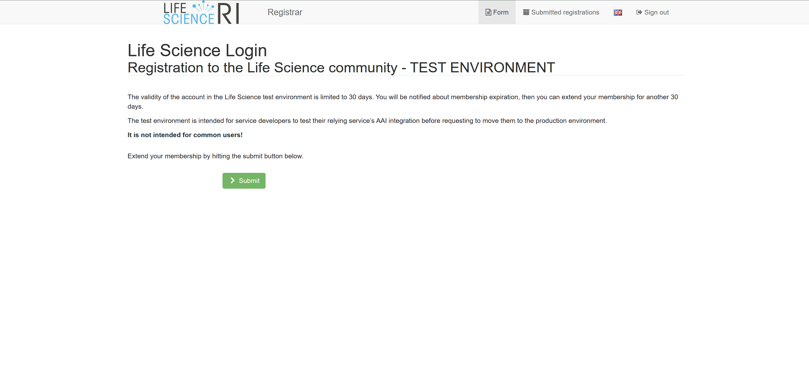

11. You have been successfuly registered to the test environment. **You can now navigate back to the ACC II page and click on *Log in* again**.
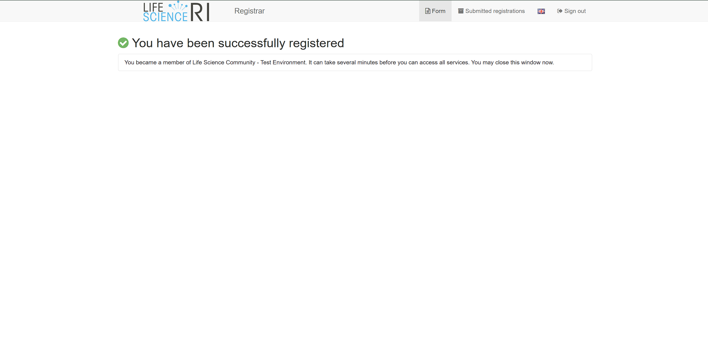

12. Consent for releasing your openid for use in ACC II. After clicking on continue, you should be logged in.
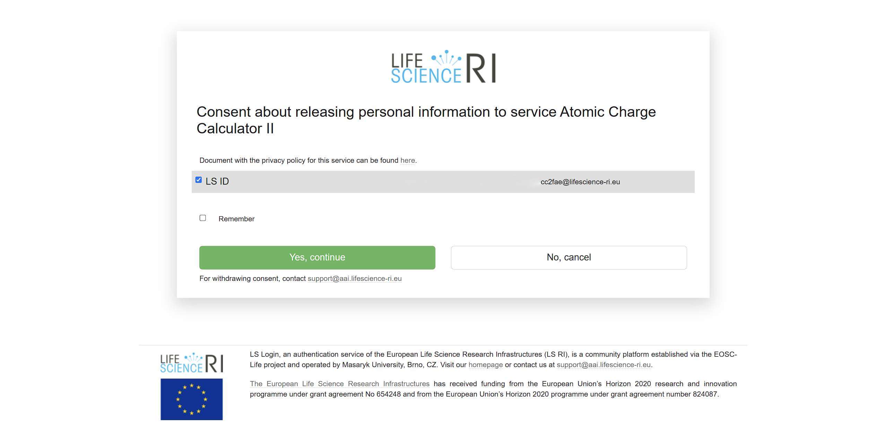
