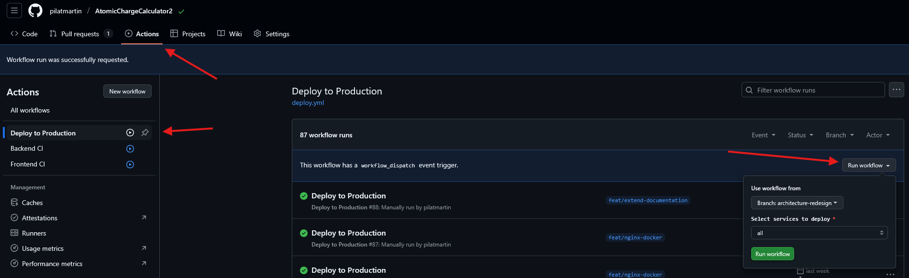
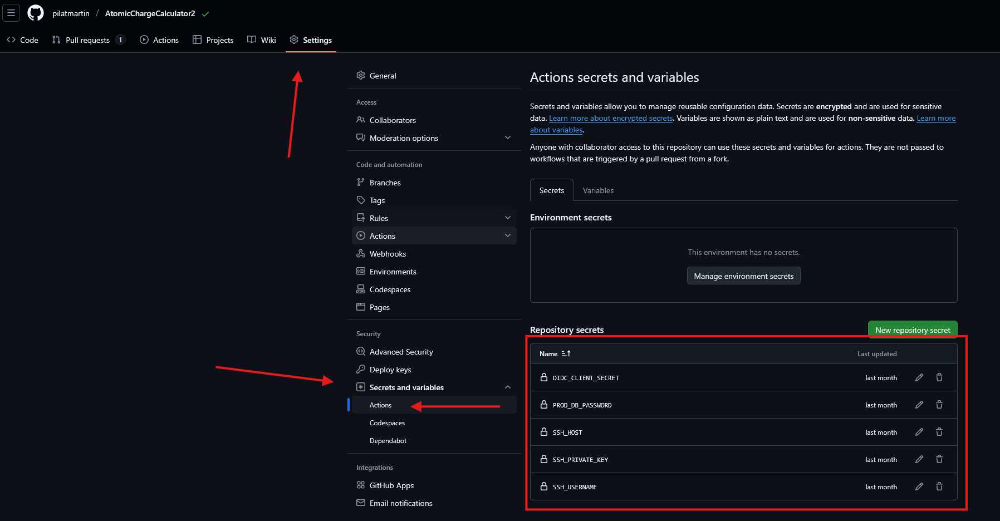

# Deployment

## Deploying to production
`Deploy to Production` GitHub Action provides a semi-automatic way to deploy new ACC II version, implemented [here](../../.github/workflows/deploy.yml). It connects to the server via SSH and rebuilds the configured containers using `docker compose`. It is triggered on `workflow_dispatch` (i.e., manual trigger).

You can trigger the deploy workflow by going to *Actions -> Deploy to Production* and choosing which branch and configuration to use during the deployment:

### Configurations
- `all` - rebuild everything
- `api` - rebuild only backend (FastAPI)
- `api including chargefw2` - rebuild API container and ChargeFW2
- `web` - rebuild only frontend
- `nginx` - rebuild only nginx container

### Secrets
Secrets are set in *Settings -> Secrets and variables -> Actions*:
